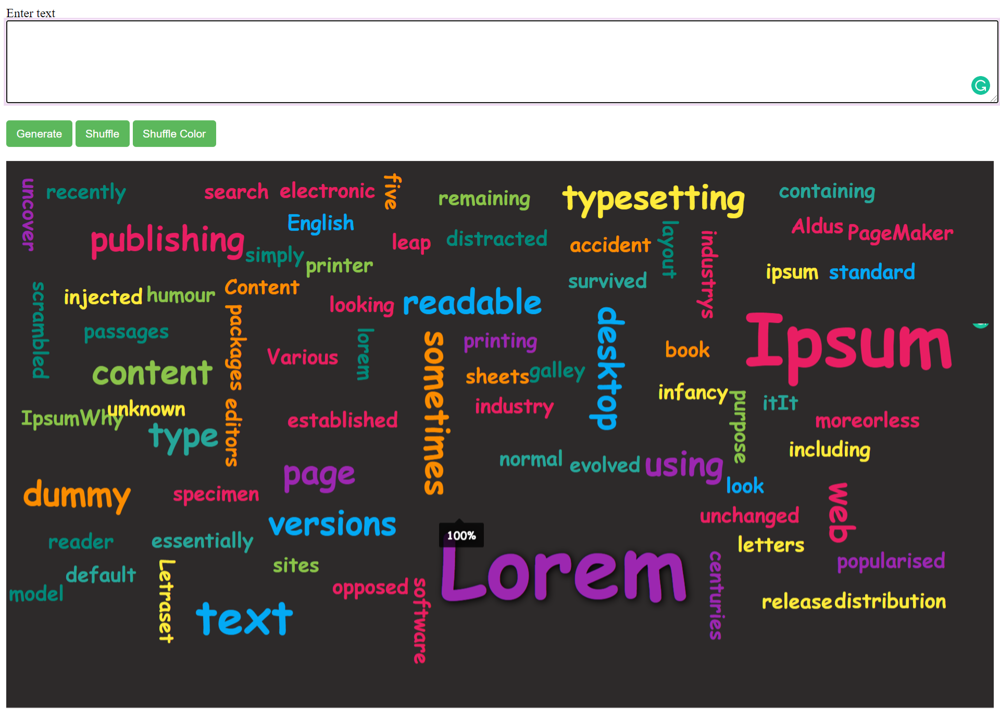

# CECS450_Project1
## Tag Cloud
A __tag cloud__ is a novelty visual representation of text data, typically used to depict keyword metadata(tags) or to visualize free form text. Tags are usually single words, and the importance of each tag is shown with font size or colour. This format is useful for quickly perceiving the most prominent terms to determine its relative prominence. The bigger word means greater weight.

## Description
* In this project, we take free text as an input, and the output is an interactive cloud, and the words are displayed depending on the frequency of the occurrence of them.
* The bigger the size of the word, the larger is the frequency of occurrence. On hovering on the word, it will display the frequency.
* We used python flask, HTML, CSS, and JavaScript for this project.

## Installation

Go to command prompt and go to the directory where the repository is located. Use the following command to install flask.

```bash
pip install flask
```

## Usage
```bash
python CECS450_Project1.py
```
* Open a web browser and go to - http://127.0.0.1:5000/test
* You will be able to access the website. A sample tag cloud will be shown.
* New text can be given in the __Enter Text__ box. Click on generate to generate a new tag cloud. You can drag the words and place them wherever you like after generating the tag cloud.
* The shuffle button can be used to shuffle all the words in the tag cloud. 
* The shuffle colour button can be used to change the colours of the words in the tag cloud.
## How it looks



